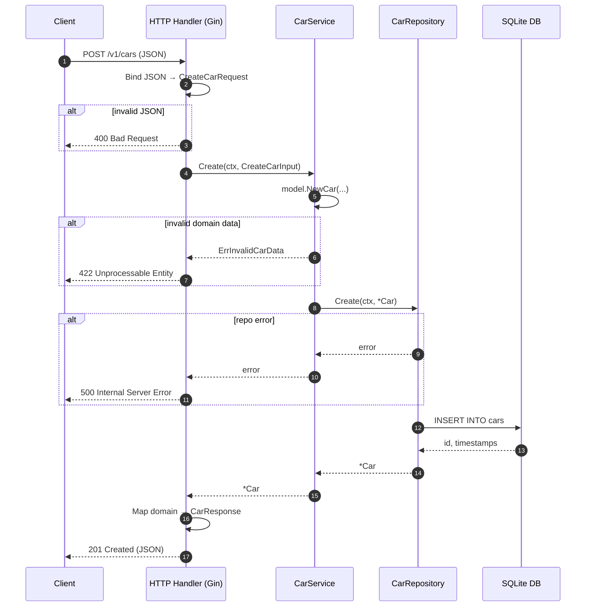

```mermaid

sequenceDiagram
    autonumber

    participant C as Client
    participant H as HTTP Handler (Gin)
    participant S as CarService
    participant R as CarRepository
    participant DB as SQLite DB

    C->>H: POST /v1/cars (JSON)

    H->>H: Bind JSON → CreateCarRequest
    alt invalid JSON
        H-->>C: 400 Bad Request
    end

    H->>S: Create(ctx, CreateCarInput)

    S->>S: model.NewCar(...)
    alt invalid domain data
        S-->>H: ErrInvalidCarData
        H-->>C: 422 Unprocessable Entity
    end

    S->>R: Create(ctx, *Car)

    alt repo error
        R-->>S: error
        S-->>H: error
        H-->>C: 500 Internal Server Error
    end

    R->>DB: INSERT INTO cars
    DB-->>R: id, timestamps

    R-->>S: *Car
    S-->>H: *Car

    H->>H: Map domain → CarResponse
    H-->>C: 201 Created (JSON)
```

